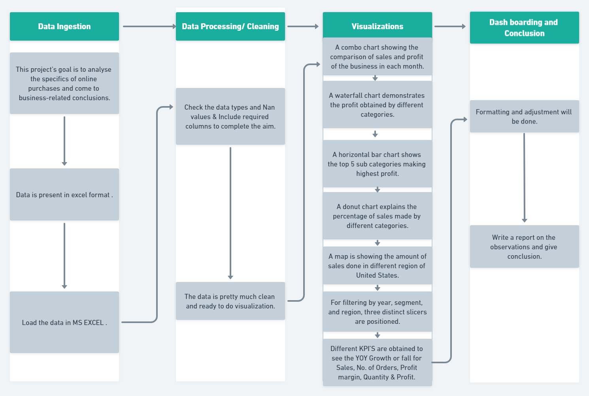
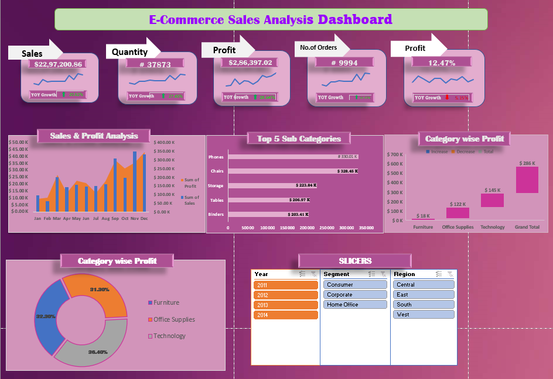

# E-commerce-Sales-Data-Analysis

## Problem Statement

An e-commerce company seeks to analyze its sales data to understand customer behavior, sales patterns, and identify revenue growth opportunities. The project aims to leverage data analytics to provide insights into customer demographics, purchase history, product categories, pricing, and marketing campaigns. The goal is to identify high-potential customer segments, improve customer engagement and loyalty, and optimize marketing and sales efforts. By comprehensively analyzing sales data, the company aims to make data-driven decisions to enhance sales and increase revenue.

## Dataset
[Explore the dataset used in this project] (https://github.com/Komalsai234/E-commerce-Sales-Data-Analysis/blob/main/Data/Ecommerce%20Sales%20Analysis.xlsx) 
## Projct WorFlow

## Analysis Dashboard

## Analysis Report
1. Phone is the subcategory that sells the most.
2. Technology is the category having highest sales.
3. Maximum profit is obtained in the month of December.
4. The total profit margin is decreasing.
5. Highest sales is obtained in the month of November.
6. California is the maximum selling state.
